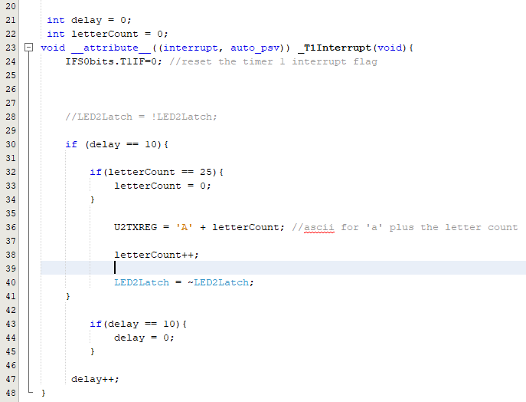
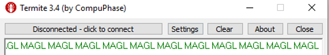

## Aim
The Aim of this program was to send and recieve data over UART on the dsPIC30F4011 using MPLAB X IDE for my Microcontroller Application Group Lab (MAGL) module at university.

## Procedure
The first step was to calculate the baud rate. This is vital to allow communications between the microcontrollers. 

From the data sheet this was calulated and U2BRG could be set to 16. U2 was the interupt used for this example.

Using a set of if statements the letter 'A' was set to the transmission register, then this was incremented 25 more times and the alphabet was transmitted:

Using a terminal window, this could be viewd:

### Another example
Another exericse was to create a function to send a string of characters

Using the timer interupt a character was sent once a second. The output of this

The string MAGL was chosen because it was the module name and due to the transmission register only being 4 bytes, only 4 characters could be held at one time and thus a small string would need to be sent.

### Fututre Works
The skills gained in from this project went on to be used to communicate sensor data between 2 dsPICs in a small robot built to complete in a micromouse-style challenge.
